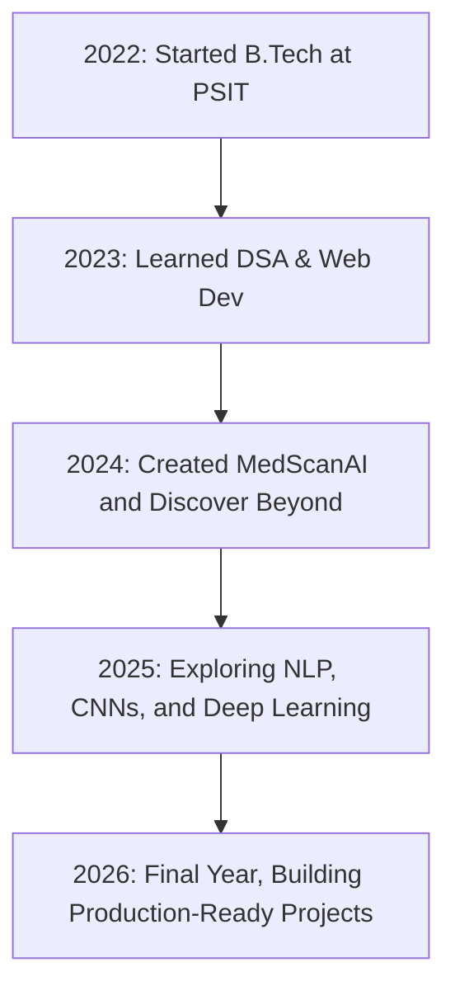

  

<h1 align="center">🚀 Dev Pratap Singh | B.Tech CSE @ PSIT</h1>

  
  
  

---

## ✨ Motto:
> “Build things that matter. Learn what excites you. Repeat.”

---

## 📜 My Developer Timeline

---

## 🧠 About Me

- 🧑‍💻 B.Tech CSE | Final-year student passionate about building scalable AI & web solutions  
- 🛠️ Working with Python, React, Node.js, MongoDB, TensorFlow  
- 🧬 Interested in NLP, CNNs, Deep Learning, Generative AI  
- 🧠 Solved 500+ DSA problems on LeetCode & HackerRank  
- 📫 Email: [devsingh.11.2003@gmail.com](mailto:devsingh.11.2003@gmail.com)

---

## 🚀 Featured Projects

### 🩻 MedScanAI – [GitHub](https://github.com/Dev-pratap-singh01/MedScanAI)
> 🧠 Fracture detection using CNN + NLP  
> 🔍 Real-time scan analysis + doctor locator + mental health score

### 🌍 Discover Beyond – [GitHub](https://github.com/Dev-pratap-singh01/Tools_and_Travels)
> ✈️ ML-based travel recommendation engine  
> 📊 95% accurate predictions using MongoDB + Python

### 🎙️ AI Voice Assistant – *(coming soon)*
> 🤖 Python-based NLP assistant for commands, weather, search, music

---

## 🧰 Tech Stack

**Languages:**  
 
 

**Frameworks:**  

**Databases:**  

**AI/ML Tools:**  

---

## 🏆 GitHub Trophies

---

## 📊 GitHub Stats

  
  

---

## 📬 Let’s Connect

  
  
  

---

  

